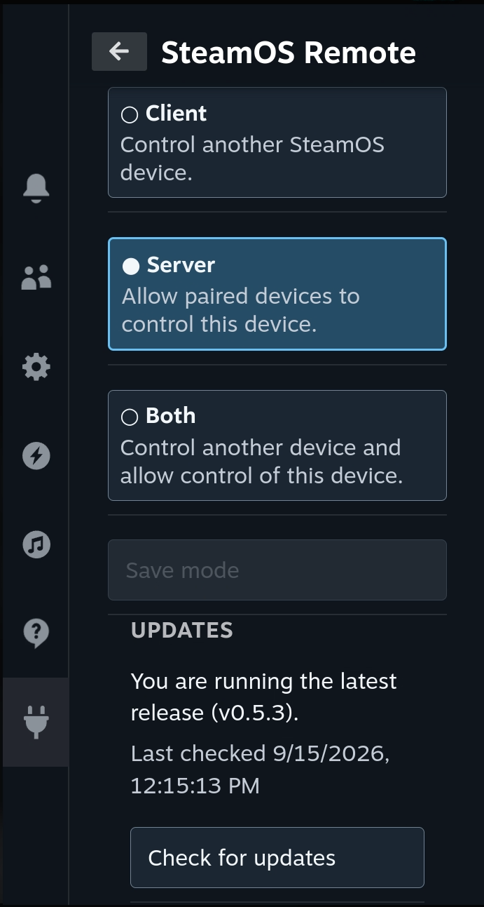

# SteamOS Remote

SteamOS Remote is a Decky Loader plugin for controlling and monitoring another
Steam Deck from the companion [Omarchy client](https://github.com/tuthan/omarchy-steam-remote)
over a local network. The same install can run as a Client, Server, or Both.

This repository contains the Decky host in `host/` and the shared protocol
contract in `protocol/`.

## Preview



## Install

Decky Loader must already be installed.

### Decky UI

1. Download `steamos-remote-decky-<version>.zip` from the
   [Releases](https://github.com/tuthan/decky-steam-remote/releases) page.
2. Install the ZIP with Decky’s plugin installer.
3. If needed, use Decky’s **Reload Plugins** action.

No reboot or Decky service restart is required.

### Updates

The plugin checks the latest stable GitHub release when it starts and every
six hours while Decky is running. From **Settings → Updates**, you can inspect
the release metadata and request an install. The release assets and SHA256
value are validated before the request is sent to Decky Loader; Decky then
downloads the ZIP, verifies it, asks for confirmation, replaces the plugin,
fixes permissions, and reloads it.
This keeps the plugin itself unprivileged and avoids `sudo` or a root flag.

### SSH

From a local checkout, install the latest release with:

```sh
ssh deck@steamdeck.local 'bash -s' < install.sh
```

To install a specific release:

```sh
ssh deck@steamdeck.local 'bash -s -- v0.5.13' < install.sh
```

The installer copies the plugin to `~/homebrew/plugins/steamos-remote` and
asks Decky to reload its plugins. Run it as the `deck` user; `sudo` is used to
create, replace, and update the Decky plugin directory. If the reload endpoint
is unavailable, use Decky’s **Reload Plugins** action.

The installer can also be run directly on the Deck:

```sh
curl -fsSL https://raw.githubusercontent.com/tuthan/decky-steam-remote/main/install.sh | bash -s -- v0.5.13
```

## Device modes

On first launch, choose the role that matches the device:

- **Client** controls one saved remote device. Discovery is an explicit,
  bounded local-network scan; manual HTTPS entry is available when discovery
  is not suitable. Display settings show common resolutions and refresh rates
  by default; Settings has an opt-in toggle for uncommon modes.
- **Server** accepts authenticated requests from paired clients and keeps the
  Decky display bridge alive while the settings panel is closed.
- **Both** enables both roles independently.

On a Server or Both device, **This device → Display order** shows the
attached physical-screen inventory and the currently identified Gaming Mode
screen. When Steam's legacy DisplayManager reports only the logical Gamescope
surface, the inventory falls back to read-only Linux DRM connector status, so
HDMI/DP connectors and disconnected ports remain visible. Live screen selection
remains disabled until the SteamOS build exposes a verified live active-output
adapter with recovery readback; the view never guesses from display order or
current resolution. For connected outputs, the list reads the non-sensitive
EDID display name, vendor, and product ID so a physical monitor can be matched
to its DP/HDMI connector; hardware serial numbers are not exposed. The Gaming
Mode monitor switch can save a guarded
ordered Gamescope `--prefer-output` priority list for the next Gaming Mode
session and
reports the current scanout with `gamescopectl` when that control tool is
available. A confirmed **Restart Gaming Mode now** action can recreate only
the Gaming Mode session to apply the saved output without entering Desktop
Mode; it closes running games and briefly interrupts the Steam UI. The plugin
does not change Desktop Mode, and live connector switching remains unavailable
on Gamescope builds without a runtime connector override.

Changing roles is an explicit saved setting. Existing host identities,
listener settings, incoming clients, and recovery profiles are preserved when
Client mode is added. Pending display recovery is allowed to finish (or can be
cancelled from Settings) before the Server role is stopped. A saved outgoing
pairing and unresolved operation journal survive Client mode being disabled.

The Client destination has Remote, Display settings, Power options, and
Connection details flows. Display previews always offer Revert first, power
actions require a confirmation, and an ambiguous mutation is never replayed
automatically; the user must acknowledge an explicit resend. Remote Gaming
Mode connector ordering is not yet exposed in Client mode.

## Pairing

Enable Server or Both on the target device, then discover it from the Client
screen or enter its address manually. The client pins the target certificate,
shows a certificate-bound comparison code, and keeps a pending request across
panel close and plugin reload. Approve the request on the target only when both
codes match. The host creates its identity and TLS certificate automatically on
first use. The listener accepts IPv4 connections on all interfaces by default;
set the host/IP override only when needed.

The target's incoming pairing card places Reject before Approve. Removing the
local pairing does not silently revoke server access; the Connection details
flow explains that distinction.

Sunshine monitoring is disabled by default and can only be enabled locally in
Decky settings. When it is disabled, the server does not probe Decky Sunshine
and paired clients hide Sunshine status and recovery controls. Auto-recovery
is enabled by default once monitoring is enabled: one owner-plugin start
request is made after a running-to-stopped observation, and the manual
Recover Sunshine action remains available if the owner cannot recover it.
On a Server or Both device, the This device view exposes Recover Sunshine
when the Decky Sunshine owner confirms that its Flatpak is stopped; recovery
calls the owner plugin and never starts a separate process.

The local Display order page writes a per-user Gamescope session override from
validated Linux DRM connectors. Reorder screens with gamepad-friendly controls,
then choose **Save for next session** or **Save and restart Gaming Mode**. The
page shows the active connector when Gamescope readback is available. Verified
live connector switching remains disabled on SteamOS builds without a selector
and recovery readback.

The installable frontend is dependency-free: it uses the native Decky
component surface when the loader exposes it and retains semantic, accessible
fallback controls for older API-v0 loaders and the local test harness. No
runtime package is downloaded during build or install.

## Releases

Update the version in `host/package.json`, commit the change, and push a
matching tag:

```sh
git tag v0.5.13
git push origin v0.5.13
```

The `Release` workflow runs the checks, builds the ZIP and SHA256 file, and
attaches both to the GitHub release. The tag must match the package version
without the leading `v`.

## Development

Run the checks and build locally:

```sh
python3 -m unittest discover -s tests -p 'test_*.py' -v
python3 -m compileall -q host protocol
node --check host/frontend/index.js
node host/frontend/test_frontend.cjs
python3 host/build.py
```

The build writes `artifacts/steamos-remote-decky-<version>.zip` and its
`SHA256` file.

## License

[MIT](LICENSE)
