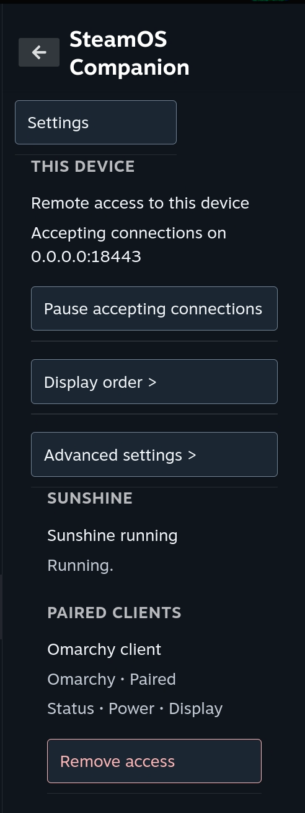
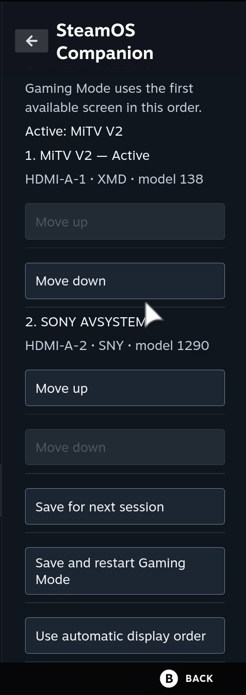

# SteamOS Companion

Control and monitor one SteamOS device from another over your local network.
SteamOS Companion is a [Decky Loader](https://decky.xyz) plugin that runs as a
**Client**, a **Server**, or **Both**. A matching
[Omarchy desktop client](https://github.com/tuthan/steamos-companion-omarchy)
is available for Linux desktops.

**Website:** <https://tuthan.github.io/steamos-companion-decky/> ·
**Releases:** <https://github.com/tuthan/steamos-companion-decky/releases>





## What it does

- **Status and power.** See whether the paired device is reachable, wake it,
  and run power actions behind a confirmation.
- **Remote display settings.** Change resolution and refresh rate with a timed
  preview that reverts unless you keep it, and restore a saved display profile
  after a bad mode.
- **Gaming Mode display order.** Reorder the physical screens Gamescope should
  prefer, locally or on the paired device, and restart Gaming Mode to apply.
- **Sunshine monitoring (opt-in).** Watch the Decky Sunshine owner plugin and
  recover it when it stops.
- **Self-updating.** Checks the latest stable release and installs it through
  Decky Loader, so the plugin never needs `sudo`.

## Security model

- Pairing shows a comparison code derived on both devices and never sent over
  the network. Approve on the server only when both codes match.
- Certificates are pinned, every client gets its own scoped token, and a server
  accepts at most four paired clients.
- Traffic stays on the local network over HTTPS on port 18443. Discovery is an
  explicit, bounded scan; manual address entry is always available.

Full contract: [protocol/README.md](protocol/README.md).

## Install

Requires Decky Loader.

- **Decky UI.** Download `steamos-companion-decky-<version>.zip` from Releases
  and install it with Decky's plugin installer.
- **SSH.** From a local checkout, install the latest release with
  `ssh deck@steamdeck.local 'bash -s' < install.sh`. Append `-- v0.5.16` to pin a version.
- **On the device.**
  `curl -fsSL https://raw.githubusercontent.com/tuthan/steamos-companion-decky/main/install.sh | bash`

On first launch pick a role: Server or Both on the device you want to control,
Client on the handheld you control it from. Discover the server from the Client
screen or enter its address, then approve the pairing on the server.

## Repository

| Path | Contents |
| --- | --- |
| `host/` | Decky plugin: Python backend and dependency-free frontend |
| `protocol/` | Protocol v1 contract shared with all clients |
| `site/` | Landing page, deployed to GitHub Pages by the `Pages` workflow |
| `tests/` | Unit tests |

## Development

```sh
python3 -m unittest discover -s tests -p 'test_*.py' -v
python3 -m compileall -q host protocol
node --check host/frontend/index.js
node host/frontend/test_frontend.cjs
python3 host/build.py   # writes artifacts/steamos-companion-decky-<version>.zip and its SHA256
```

## Releases

Bump the version in `host/package.json`, commit, and push a matching tag:

```sh
git tag v0.5.16
git push origin v0.5.16
```

The `Release` workflow builds the ZIP and SHA256 file and attaches both to the
GitHub release.

## License

[MIT](LICENSE). SteamOS Companion is an independent open-source project and is
not affiliated with or endorsed by Valve Corporation.
